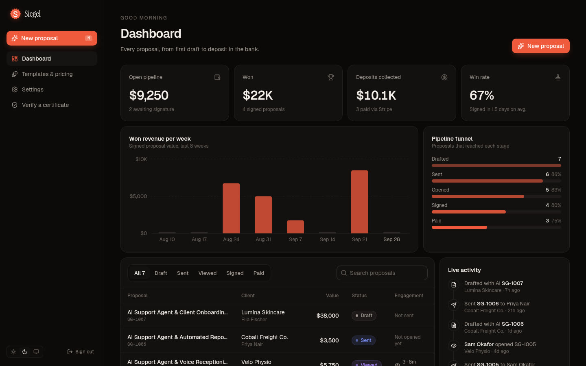
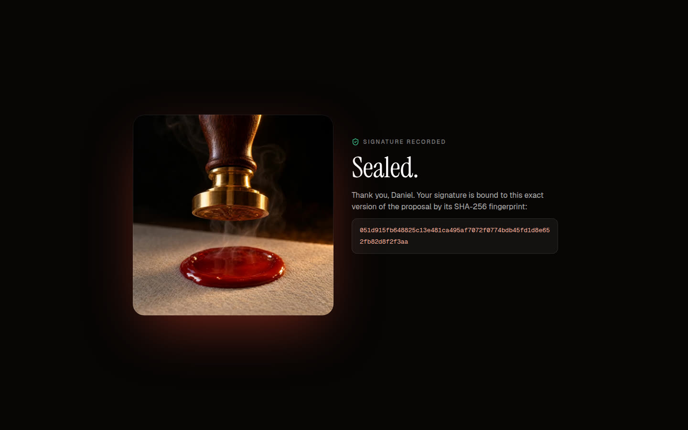
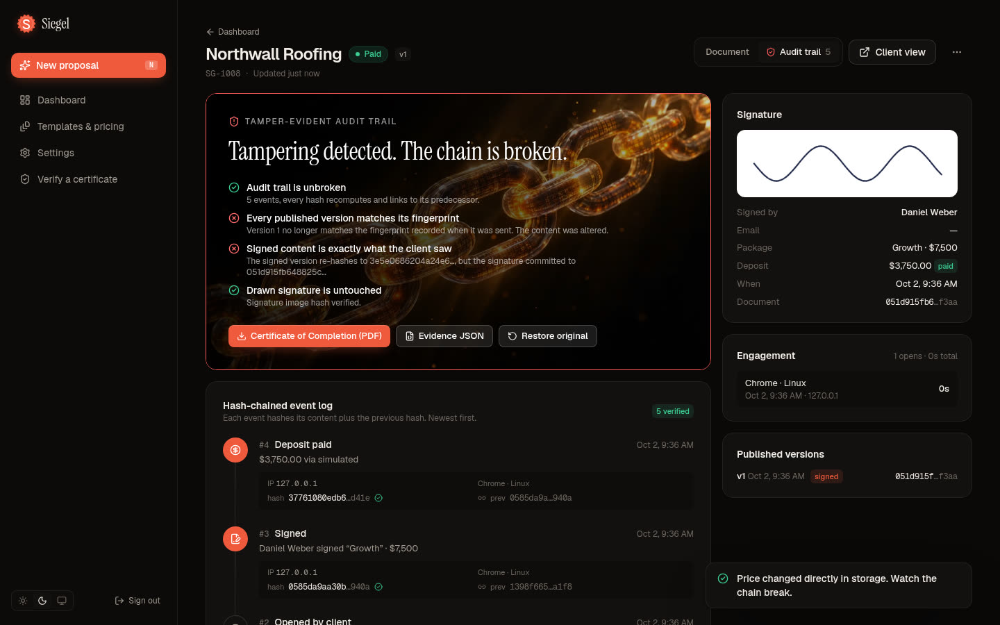
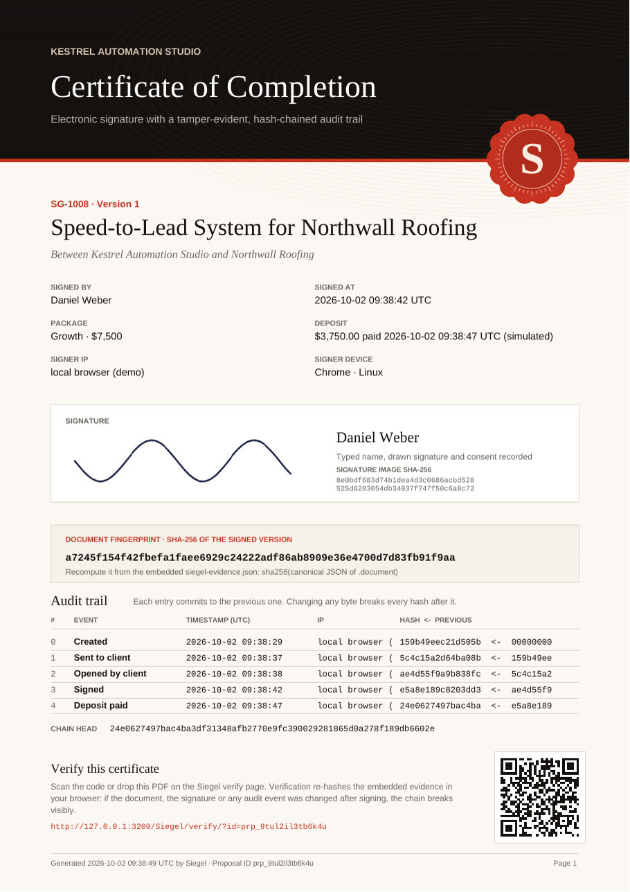
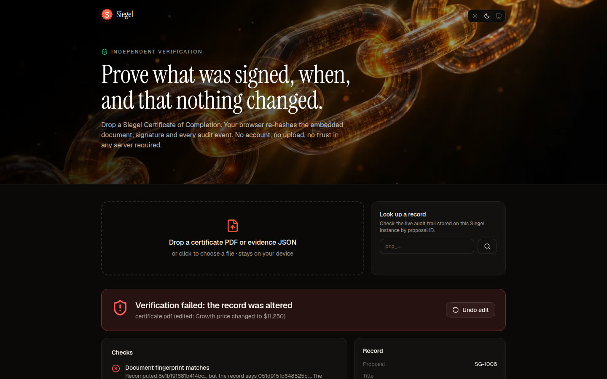
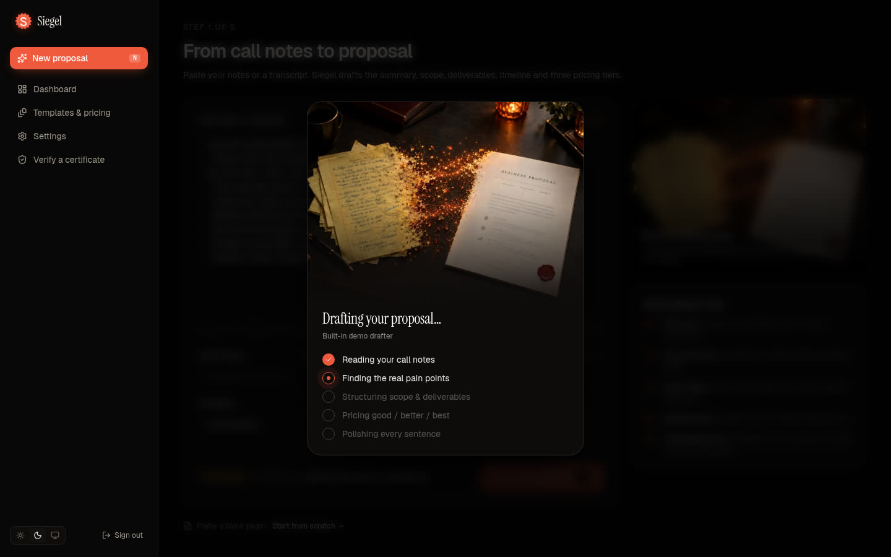
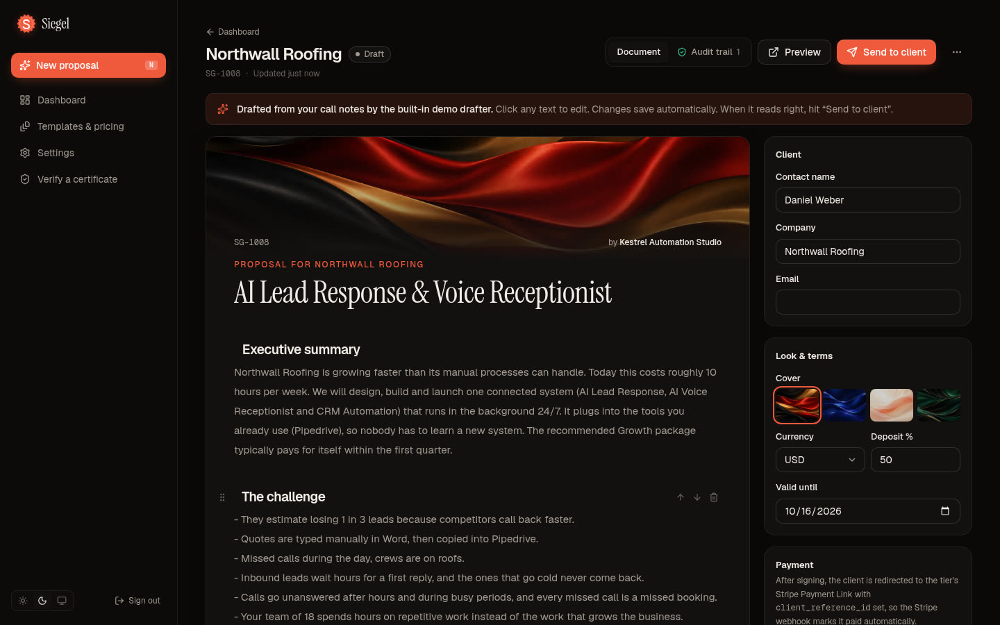
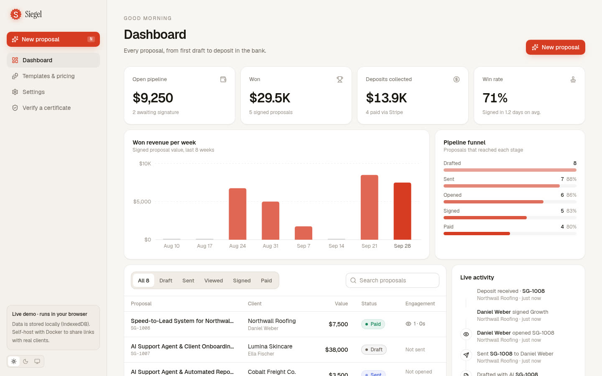

<p align="center">
  
</p>

<h1 align="center">Siegel</h1>
<p align="center"><b>Proposals that close themselves.</b><br/>
From call notes to signed and paid in under 5 minutes, with signatures you can actually prove.<br/>Free, self-hosted, yours.</p>

<p align="center">
  <a href="https://marcelweissgerberit.github.io/Siegel/"><b>▶ Live demo</b></a> ·
  <a href="public/siegel-pitch.mp4">60-second pitch video</a> ·
  <a href="#self-host-in-one-command">Self-host</a> ·
  <a href="#verifiable-signatures">How the proof works</a>
</p>

---

**Replaces** PandaDoc / Proposify (~$35–65 per user / month) **+** DocuSign (~$15–45 / month) **+** the payment tool in between.
**For** AI automation agencies, freelancers and consultants.

Agencies lose deals between the sales call and the signature. Writing a proposal takes hours, the client gets a PDF they ignore, signing needs a separate tool and payment a third. Siegel is one self-hosted app that turns call notes into a signed, paid deal:

| # | Step | What happens |
|---|------|--------------|
| 1 | **Paste call notes** | AI (bring your own key: **Anthropic, OpenAI or OpenRouter**) drafts problem summary, scope, deliverables, timeline and 2–3 pricing tiers. Works offline with a built-in demo drafter. |
| 2 | **Edit inline, send one link** | Click any sentence to edit; autosaved. Publishing fingerprints the exact version the client will see. |
| 3 | **Client picks a tier & signs** | A beautiful, mobile-first proposal page. Typed name + drawn signature, bound to the document hash. |
| 4 | **Instant deposit** | Straight from the signature to **Stripe Checkout** for exactly the deposit of the chosen package. Paste one Stripe key; Siegel creates the checkout and registers its own webhook. (Prefer no key? Payment Links per tier work too.) |
| 5 | **Automations fire** | Signed webhooks `proposal.viewed`, `proposal.signed`, `proposal.paid` (+ `proposal.sent`) kick off onboarding in **n8n, Make or Zapier**. |

<p align="center"></p>

## Verifiable signatures

Most cheap e-sign clones save a picture of a signature. Siegel proves **what** was signed, **when**, and that **nothing changed since**.

- **Document fingerprint.** Every published version is canonicalised (sorted-key JSON, no whitespace) and hashed with SHA-256. The client sees the fingerprint on the page and in the consent checkbox. If the owner edits after sending, the client only sees the change after a new version is published, and signing is rejected if the client is looking at a stale version.
- **Hash-chained event log.** `created → sent → viewed → signed → paid`. Each event stores timestamp, IP and user agent, and its hash covers its own data **plus the previous event's hash**. The signing event commits to the document fingerprint and to the SHA-256 of the drawn signature image. SQLite enforces `UNIQUE(proposal_id, seq)`, so the chain can't fork.
- **Certificate of Completion (PDF).** Signer, package, deposit, the full audit chain, chain head and a QR code, plus an appendix with the complete signed document. The machine-readable evidence (`siegel-evidence.json`) is **embedded inside the PDF**.
- **Independent verification.** Drop the PDF on `/verify`: your browser extracts the evidence and re-hashes the document, signature and every event locally. No account, no upload, no trust in the server. If anything changed after signing, the chain breaks visibly.
- **Tamper test (demo).** On a signed proposal's *Audit trail* tab, "Tamper test" edits the price directly in storage. The record verification turns red and shows exactly which check failed. "Restore original" makes it whole again.

```js
// Verify a certificate yourself, anywhere:
const c = v => v === null || typeof v !== "object" ? JSON.stringify(v)
  : Array.isArray(v) ? "[" + v.map(c) + "]"
  : "{" + Object.keys(v).sort().map(k => JSON.stringify(k) + ":" + c(v[k])).join(",") + "}";
sha256(c(evidence.document)) === evidence.documentHash
```

<table>
<tr>
<td width="50%"></td>
<td width="50%"></td>
</tr>
<tr>
<td></td>
<td></td>
</tr>
</table>

## Features (MVP)

- [x] **Dashboard**: Draft / Sent / Viewed / Signed / Paid, open pipeline value, won revenue, deposits collected, win rate, average time-to-sign, weekly won revenue, funnel, live activity feed
- [x] **AI proposal generator** from notes or transcripts, guided by a **brand profile** (logo, color, company details, default terms, deposit, currency, validity)
- [x] **Reusable templates** and a **pricing library** (insert packages into any proposal)
- [x] **Public proposal page** with **view tracking** (opens, sessions, device, IP, time on page)
- [x] **E-signature** with hash-chained audit log and **PDF certificate** with embedded evidence
- [x] **Stripe Checkout with one key**: a checkout per signature for the exact deposit, confirmed the moment the client returns, plus an auto-registered webhook. Or **Payment Links per tier** without a key
- [x] **Outgoing webhooks** with HMAC-SHA256 signatures, delivery log and test button
- [x] **Single-user auth** (scrypt-hashed password, session cookies, login rate limit), **SQLite**, **one Docker container**
- [x] **Installable PWA**: add Siegel to your home screen or dock; app shortcuts (New proposal, Dashboard, Verify); the browser demo works fully offline
- [x] Dark and light mode, mobile-first client page, fully English UI
- [x] Data export (JSON), no vendor lock-in; AI key stored server-side, never sent to the browser

<table>
<tr>
<td width="50%"></td>
<td width="50%"></td>
</tr>
<tr>
<td></td>
<td></td>
</tr>
</table>

## Self-host in one command

```bash
git clone https://github.com/MarcelWeissgerberIT/Siegel.git && cd Siegel
echo "SIEGEL_PASSWORD=change-me" > .env   # optional: otherwise you create it on first visit
docker compose up -d                      # → http://localhost:3000
```

Data lives in the `siegel-data` volume (`/data/siegel.db`, SQLite in WAL mode). Back it up by copying that one file.

**Railway:** New project → Deploy from GitHub repo. `railway.json` builds the Dockerfile and health-checks `/api/health`; add a volume mounted at `/data`.
**Render:** New → Blueprint → this repo. `render.yaml` provisions a Docker web service with a 1 GB disk at `/data` and a generated password.
**Plain Node (≥ 20.9):** `npm ci && npm run build && SIEGEL_DATA_DIR=./data npm start`.

### Configuration

| Variable | Default | Purpose |
|---|---|---|
| `SIEGEL_PASSWORD` | – | Owner password. If unset, you create one on first visit (stored scrypt-hashed). |
| `SIEGEL_PUBLIC_URL` | request host | Base URL for client links, emails and certificates, e.g. `https://proposals.youragency.com`. Also settable in *Settings → Payments*. |
| `STRIPE_SECRET_KEY` | – | Stripe secret or restricted key. Alternative to *Settings → Payments → Connect*. |
| `STRIPE_WEBHOOK_SECRET` | – | Signing secret (`whsec_…`) of a webhook endpoint you added by hand. Not needed when Siegel registers the webhook itself. |
| `SIEGEL_DATA_DIR` | `./data` (`/data` in Docker) | Where `siegel.db` lives. |
| `SIEGEL_DEMO` | `0` | `1` turns an instance into a demo: sample data, password `demo`, simulated checkout, tamper test. **Never on a real install.** |
| `PORT` | `3000` | HTTP port. |

**AI provider** (*Settings → AI provider*): pick Anthropic (default model `claude-opus-5-5`), OpenAI or OpenRouter, paste your key, *Test connection*. Any model ID works. Anthropic calls use structured outputs (JSON schema) and the server-side refusal fallback; OpenAI uses strict JSON schema; OpenRouter uses JSON mode with schema validation. Without a key, the offline demo drafter still produces a solid draft.

**Stripe** (*Settings → Payments*), recommended: create a [restricted key](https://dashboard.stripe.com/apikeys) with write access to **Checkout Sessions** and **Webhook Endpoints** (a secret key works too), paste it and click *Connect*. That's all:

- When a client signs, Siegel opens a Stripe Checkout for the deposit of exactly the package and version they signed (`client_reference_id` = proposal, signer's email prefilled, document hash in the metadata). Card, Apple Pay, Google Pay, SEPA: whatever your Stripe account has enabled.
- When the client comes back, Siegel asks Stripe directly and marks the proposal paid. The webhook (`checkout.session.completed`, `checkout.session.async_payment_succeeded`) is registered in your Stripe account automatically and covers clients who close the tab and delayed methods like SEPA.
- Stripe only delivers webhooks to a public HTTPS URL. On `localhost` Siegel skips registration and still confirms payments on return; click *Register webhook* once it's online.
- If a permission is missing, Stripe's error names it and Siegel shows it as is.

Without a key: create a Payment Link per deposit amount and paste it into the tier, add the endpoint `https://<your-host>/api/stripe/webhook` for `checkout.session.completed` and paste its signing secret. Siegel appends `client_reference_id` and `prefilled_email` to the link.

Tip: `STRIPE_API_BASE=http://localhost:12111` points Siegel at [stripe-mock](https://github.com/stripe/stripe-mock) for offline testing.

**Webhooks** (*Settings → Webhooks*): add your n8n / Make / Zapier URL, choose events. Each request carries `X-Siegel-Event` and `X-Siegel-Signature: t=<unix>,v1=<hex>` where `v1 = HMAC_SHA256(secret, t + "." + rawBody)`.

```json
{
  "id": "evt_…", "event": "proposal.signed", "createdAt": "2026-10-02T14:09:57.000Z",
  "proposal": { "id": "prp_…", "number": "SG-1004", "title": "…", "status": "signed",
                "currency": "USD", "value": 9500,
                "client": { "name": "…", "company": "…", "email": "…" },
                "url": "https://…/p/?t=…" },
  "data": { "tier": { "id": "tier_…", "name": "Growth", "price": 9500, "billing": "one-time" },
            "deposit": 4750, "signer": { "name": "…", "email": "…" }, "docHash": "9f2c…" }
}
```

## Install it as an app (PWA)

Siegel ships a web app manifest and a service worker, so Chrome, Edge and Safari offer **Install** / **Add to Home Screen** (there's also an "Install Siegel as an app" button in the sidebar). The installed app opens in its own window with shortcuts for *New proposal*, *Dashboard* and *Verify*.

- App pages and build assets are cached; pages are network-first, so updates show up immediately when online.
- `/api/*` (auth, RPC, Stripe webhooks) is never cached.
- In the browser demo, all data lives in IndexedDB, so once installed it **works completely offline**: draft, edit, sign, verify.

## The live demo

The GitHub Pages demo is the **same codebase built as a static export**: the business logic runs in your browser and data is stored in IndexedDB, so you can try everything without a server. Draft a proposal, send it, open the client link (same browser), sign, pay the simulated deposit, download the certificate, then verify it or run the tamper test. Settings → Data → *Reset demo data* starts over.

Because there's no server in that build, client links only work in the browser that created them and payments use a clearly labelled simulated checkout. Self-host for real links and Stripe.

## Architecture

```
src/
  core/          isomorphic business logic (runs in Node and in the browser)
    service.ts     proposals, versions, signing, payments, webhooks, tamper test
    payments.ts    Stripe Checkout gateway interface (server injects the official SDK)
    chain.ts       canonical document, hash-chained events, verification
    certificate.ts PDF certificate (pdf-lib) + evidence embedding/extraction
    ai.ts          Anthropic SDK / OpenAI / OpenRouter drafting with JSON schema
    demo-drafter.ts offline heuristic drafter
    handlers.ts    one RPC surface shared by server and browser
  server/        SQLite repository (better-sqlite3), auth, request context
  client/        RPC client (server mode) or in-browser service + IndexedDB (static mode)
  app/           Next.js 16 App Router pages + API routes (rpc, auth, stripe/webhook, health)
tests/           node:test suite for the core (chain, tamper, certificate round-trip)
```

One codebase, two build targets: `npm run build` produces the self-hosted server (`output: "standalone"`); `npm run build:pages` (`SIEGEL_STATIC=1`) produces the static demo, where only `.tsx` files are routes so the API handlers and server code are left out.

## Development

```bash
npm install
SIEGEL_DEMO=1 npm run dev     # http://localhost:3000, password "demo"
npm test                      # core tests
npm run lint && npm run typecheck
npm run build                 # standalone server in .next/standalone
SIEGEL_BASE_PATH=/Siegel npm run build:pages   # static demo in ./out
```

## Credits

Visuals and motion loops (wax seal, seal-press, hash-chain, silk covers) were generated with **Higgsfield** (GPT Image 2.5, Kling 3.0, Cinema Studio). Prompts are in [`docs/MEDIA.md`](docs/MEDIA.md).

## License

MIT
